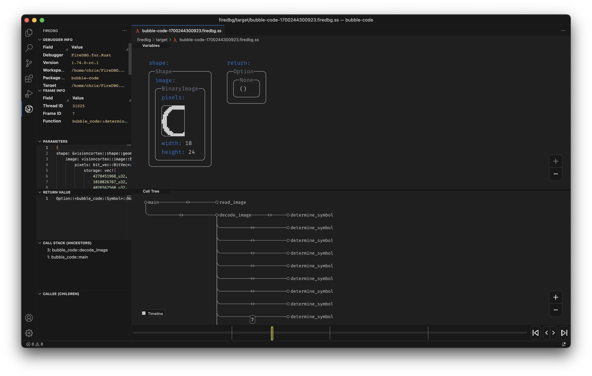
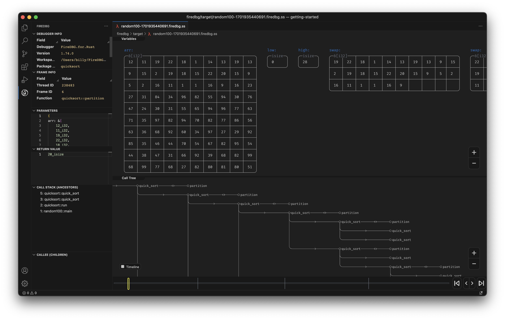
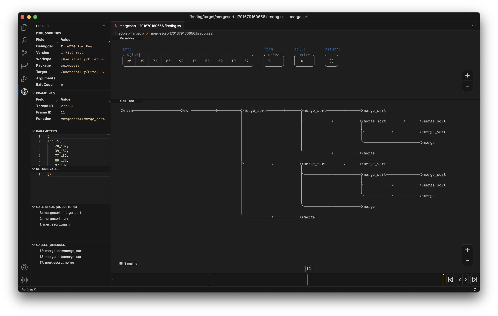
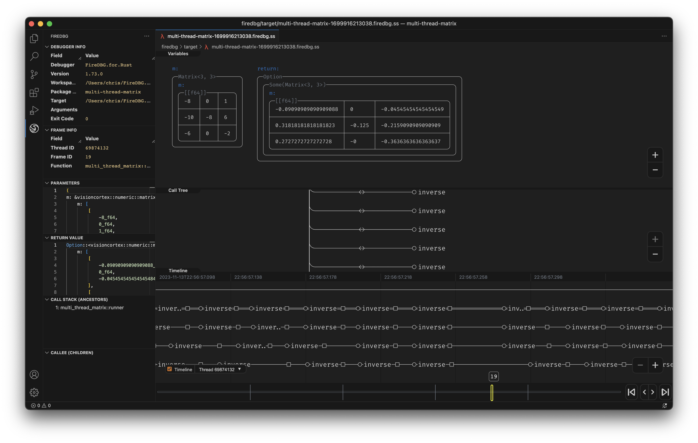
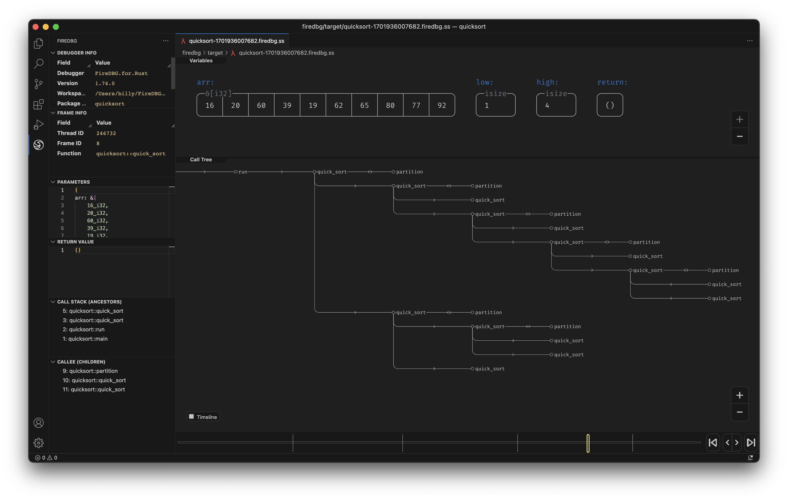
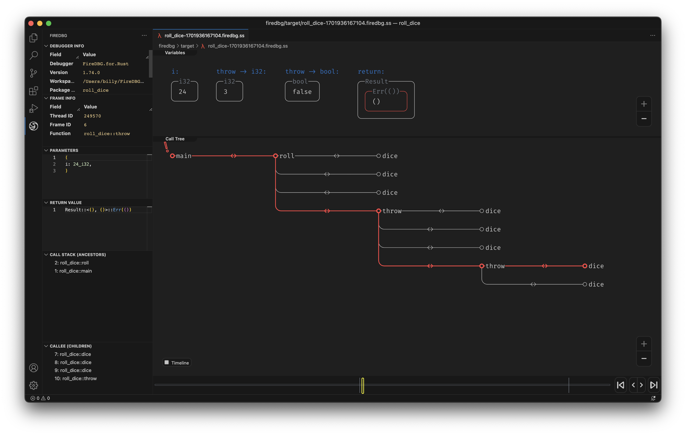
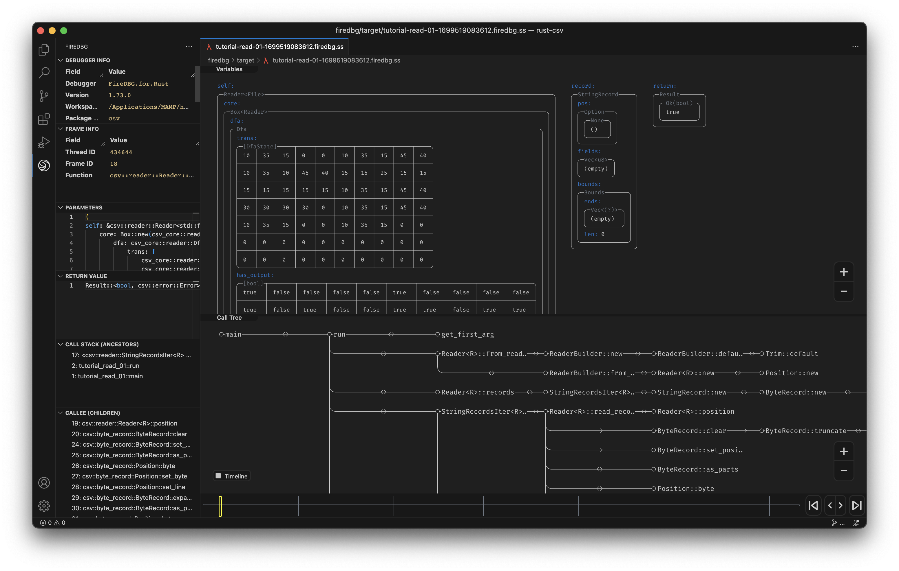
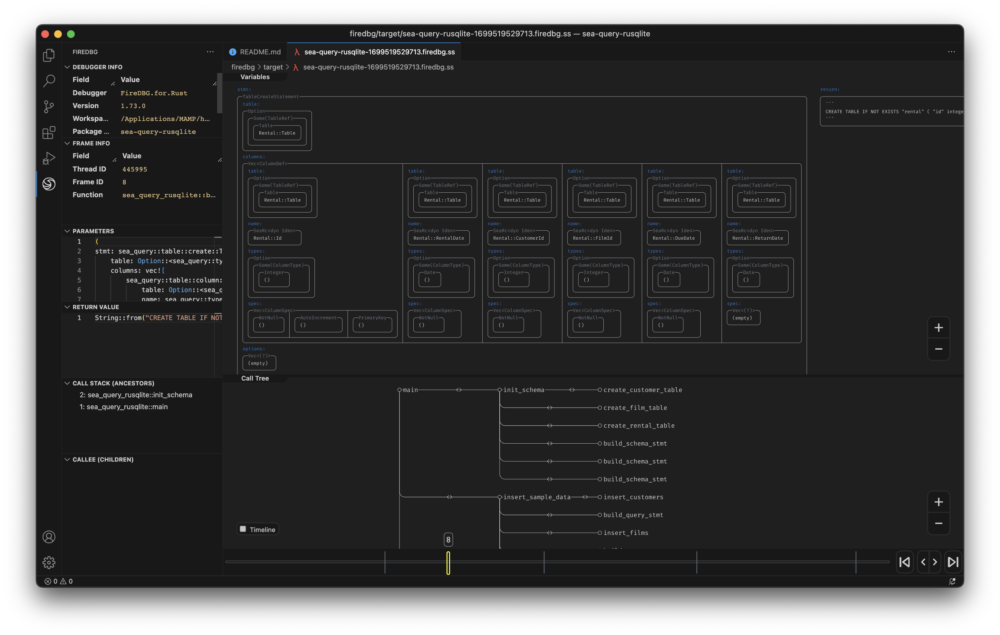
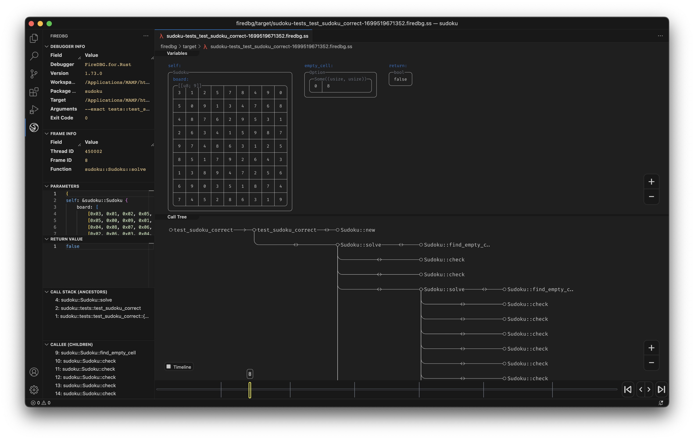
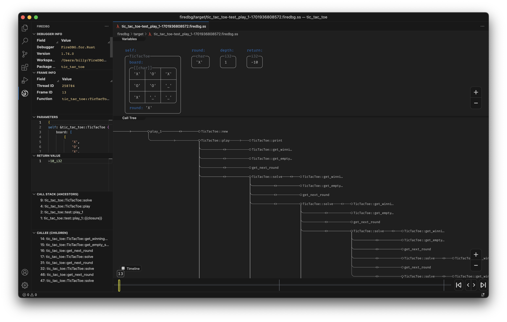

# The Rust Testbench for FireDBG

1. [`bubble-code`](bubble-code) 
1. [`cargo-expand`](cargo-expand) 
1. [`getting-started`](getting-started) 
1. [`mergesort`](mergesort) 
1. [`multi-thread-matrix`](multi-thread-matrix) 
1. [`quicksort`](quicksort) 
1. [`roll_dice`](roll_dice) 
1. [`rust-csv`](rust-csv) 
1. [`sea-query-rusqlite`](sea-query-rusqlite) 
1. [`sudoku`](sudoku) 
1. [`tic_tac_toe`](tic_tac_toe) 