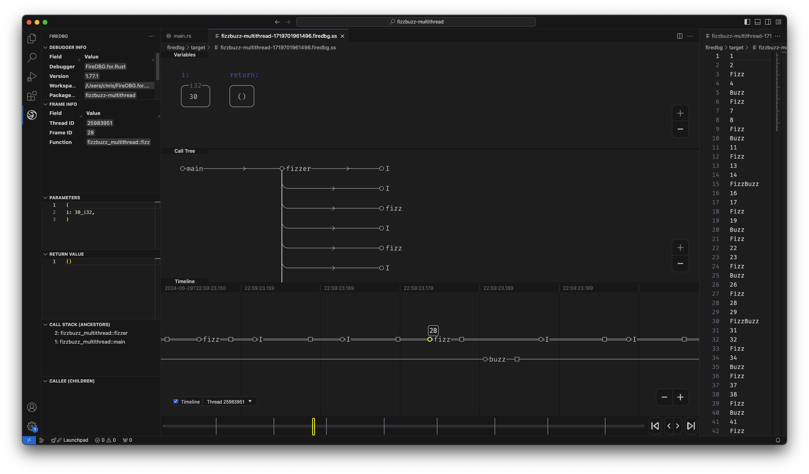

# FizzBuzz Multi-threaded

This demo serves to demonstrate multi-threaded programming and synchronization via message passing in Rust.

A more thorough discussion can be found on https://firedbg.sea-ql.org/blog/2024-06-30-fizzbuzz-multithread/



Debug with FireDBG debugger:

```sh
firedbg run fizzbuzz-multithread
```